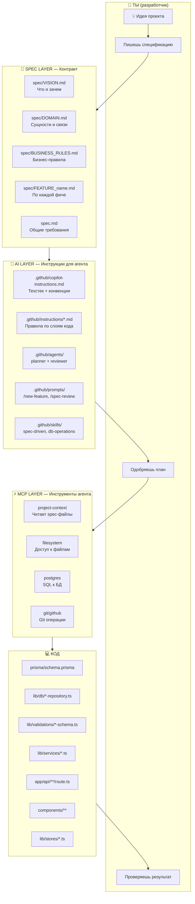
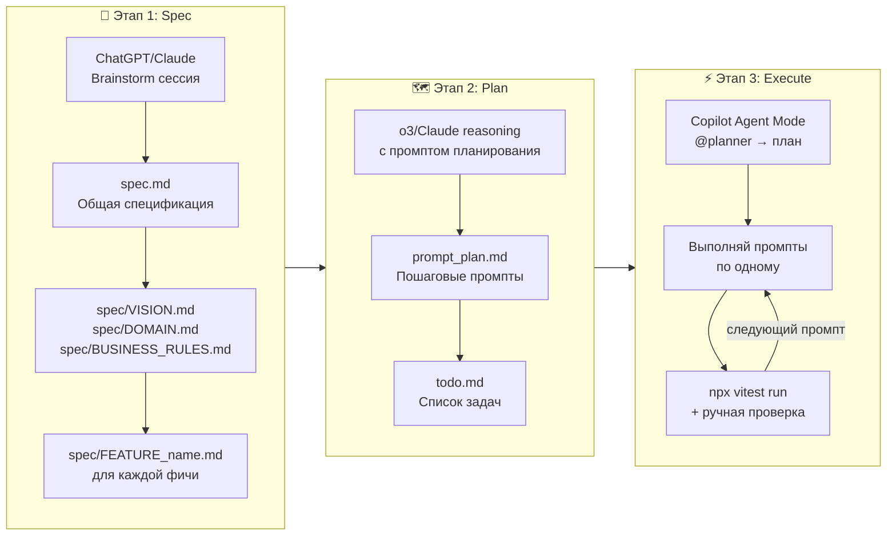
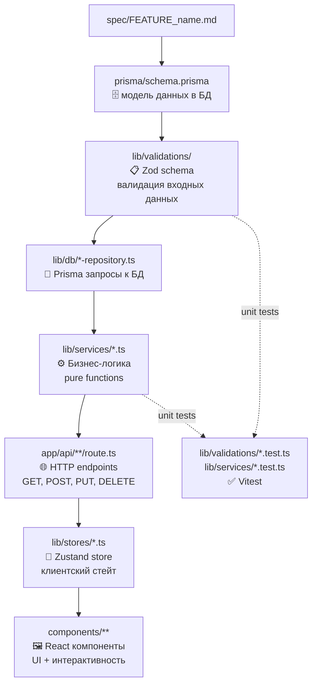

# Как работает vibe-coder-template — Визуальный гайд

## Что это такое?

**Стартовый шаблон** для разработки с GitHub Copilot.
Смысл: агент не гадает что делать — у него есть готовые инструкции, спецификации и правила.
Ты пишешь spec → агент пишет код.

---

## Общая архитектура системы



---

## Рабочий процесс: от идеи до кода (Harper Reed Workflow)



### Этап 1: Brainstorm → `spec.md`

Используй ChatGPT/Claude с промптом:
```
Ask me one question at a time so we can develop a thorough, step-by-step spec
for this idea. Our end goal is a detailed specification I can hand off.
Only one question at a time.

Here's the idea: [ОПИСАНИЕ ИДЕИ]
```

После сессии попроси:
```
Now compile our findings into a developer-ready specification with all
requirements, architecture choices, error handling, and testing plan.
```

Сохрани результат в `spec.md` и разбей по файлам `spec/*.md`.

### Этап 2: Plan → `prompt_plan.md`

Используй reasoning-модель (o3/Claude) с промптом:
```
Draft a step-by-step blueprint for building this project.
Break into small iterative steps that build on each other.
Provide prompts for a code-generation LLM with TDD approach.
No hanging code — every step integrates into previous.

<SPEC>
[содержимое spec.md]
</SPEC>
```

Сохрани как `prompt_plan.md`, список задач — в `todo.md`.

### Этап 3: Execute → Agent Mode

Выполняй промпты из `prompt_plan.md` по одному в Copilot Agent Mode.
После каждого: `npx vitest run` + ручная проверка + отмечай в `todo.md`.

---

## Порядок создания файлов при реализации фичи



**Важно:** всегда строго соблюдать этот порядок — каждый слой зависит от предыдущего.

---

## Назначение файлов в `.github/`

| Файл/папка | Что делает | Когда применяется |
|---|---|---|
| `copilot-instructions.md` | Техстек, структура папок, code guidelines | **Всегда** — загружается автоматически |
| `instructions/ai-agent-rules.md` | Правила поведения агента (язык, фокус, запреты) | Применяется к `**` |
| `instructions/typescript.md` | TS strict, без `any`, функциональные компоненты | Применяется к `**/*.ts,tsx` |
| `instructions/api-routes.md` | Zod перед БД, правильные HTTP коды | Применяется к `app/api/**` |
| `instructions/prisma.md` | Только через репозитории, singleton клиент | Применяется к `lib/db/**` |
| `instructions/tests.md` | Vitest паттерны, что и как тестировать | Применяется к `**.test.ts` |
| `agents/planner.agent.md` | `@planner` — только планирует, не пишет код | Ручной вызов `@planner` |
| `agents/reviewer.agent.md` | Code review на соответствие spec | Ручной вызов |
| `prompts/new-feature.prompt.md` | `/new-feature name` — реализовать фичу | Slash command |
| `prompts/spec-review.prompt.md` | `/spec-review` — сравнить код со spec | Slash command |
| `prompts/new-component.prompt.md` | `/new-component name` — создать компонент | Slash command |
| `skills/spec-driven/SKILL.md` | Детальный workflow реализации фичи | Автоматически при "реализуй/добавь" |
| `skills/db-operations/SKILL.md` | Паттерны репозиториев и Prisma | Автоматически при работе с БД |

---

## Три слоя системы

| Слой | Что это | Кто это использует |
|------|---------|-------------------|
| **`spec/`** | Контракт: что нужно построить | Ты пишешь, агент читает |
| **`.github/`** | Инструкции для агента | Copilot читает автоматически |
| **`mcp/`** | Инструменты агента (сервер) | Copilot вызывает через VS Code |

---

## Как начать новый проект

```bash
# 1. Скопируй шаблон
cp -r E:\project\vibe-coder-template E:\project\my-project
cd E:\project\my-project

# 2. Установи зависимости
npm install

# 3. Настрой .env.local
cp .env.example .env.local
# → DATABASE_URL=postgresql://...

# 4. Собери MCP сервер
npm run mcp:build

# 5. Перезапусти VS Code — MCP стартует автоматически
```

Затем:
1. Заполни `spec/VISION.md`, `spec/DOMAIN.md`, `spec/BUSINESS_RULES.md`
2. Создай `spec/FEATURE_name.md` для каждой фичи (из шаблона `FEATURE_template.md`)
3. Замени `[PROJECT_NAME]` в `.github/copilot-instructions.md`
4. Заполни `spec.md` через brainstorm-сессию
5. Сгенерируй `prompt_plan.md` через reasoning-модель
6. Открой Copilot Agent Mode → выполняй промпты по одному

---

## Ключевые команды в чате Copilot (Agent Mode)

```
@planner реализуй фичу X     → составит план без кода, потом передаст агенту
/new-feature auth             → реализует фичу auth по spec
/spec-review                  → проверит соответствие текущего кода spec
/new-component UserCard       → создаст React компонент
```

---

## Главный принцип

> **Нет spec → нет кода.**
>
> Агент обязан прочитать `spec/FEATURE_name.md` перед любой реализацией.
> Если файла нет — он скажет тебе создать его сначала.
> Это предотвращает ситуацию когда агент гадает и делает не то что нужно.
